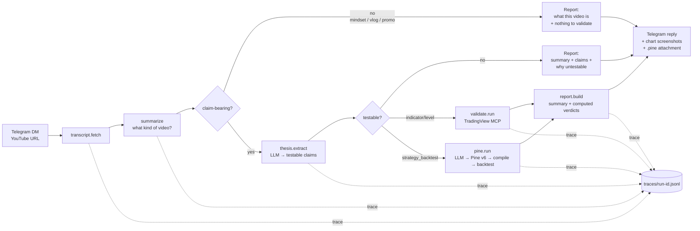

# agent-research-lab


**An autonomous validation and orchestration system — adjacent to eval infrastructure, observability tooling, and research automation. The domain is trading content. The engineering pattern is general.**

*By [R Sai Pavan](https://www.linkedin.com/in/sai-pavan-86635b23/) — autonomous systems operator. This repo is a public, end-to-end demonstration of how I design systems that reason, validate, and degrade gracefully.*

This is **not** a trading bot, a signal generator, or an AI that watches YouTube videos.

It is a **validation and orchestration system** that happens to operate on trading content. The domain is incidental. The pattern — deterministic evaluation, causal validation, explicit uncertainty, observable workflows, graceful degradation at every failure point — transfers directly to any autonomous research pipeline operating under uncertainty.

The strongest thing in this repo is **operational honesty**: the system repeatedly rejects claims, surfaces ambiguity, preserves failure traces, and avoids overclaiming. That's the design, not the domain.

---

## Quickstart

```bash
pip install -e .
python -m agent_research_lab.orchestrate "https://www.youtube.com/watch?v=..."
```

What happens, step by step:

```
Transcript fetched      — pulls and cleans the YouTube transcript
        ↓
Video classified        — content type, topic, whether it makes checkable claims
        ↓
Claims extracted        — each claim tagged: instrument, timeframe, test type, testable?
        ↓
Claim operationalized   — trigger condition + outcome window formalized into a runnable test
        ↓
Validation executed     — real market data via TradingView MCP; for strategy claims, Pine Script synthesized + compiled + backtested
        ↓
Verdict computed        — thresholds applied in code, not LLM-judged: holds / partial / fails / untestable
```

Real output from [`examples/06_orb_pine_strategy_backtest/`](examples/06_orb_pine_strategy_backtest/):

**Claim extracted:**
```
ORB: enter long when price closes above the first-15-minute high, enter short when
price closes below the first-15-minute low. Stop at the opposite end of the opening
range. Target 1.5x range size. Exit all positions by 3 PM. Works consistently on SPY.

instrument: SPY | timeframe: 5m | test_type: strategy_backtest | testable: yes | confidence: 0.95
```

**Validation executed:**
```
Pine Script synthesized → compiled (0 errors) → strategy tester run
66 trades | win rate 48% | net profit −4,082 | profit factor 0.91 | max drawdown 6,560
```

**Verdict computed:**
```
NOT SUPPORTED — no edge: profit factor 0.91, net profit −4,082.41 over 66 trades
```

**Trace (`trace.jsonl`):**
```jsonl
{"step": "transcript.fetch",  "ok": true, "ms": 0,     "detail": "fetched 218 words"}
{"step": "video.summarize",   "ok": true, "ms": 312,   "detail": "strategy_or_claim — ORB intraday strategy — SPY 5-minute"}
{"step": "thesis.extract",    "ok": true, "ms": 1847,  "detail": "1 claim: 1 testable, 0 not"}
{"step": "pine.run",          "ok": true, "ms": 28340, "detail": "PF 0.91 over 66 trades — net negative"}
{"step": "report.build",      "ok": true, "ms": 4,     "detail": "verdict_overall=fails; 1 claim"}
```

Every run saves the full artifact bundle to `runs/<run_id>/`: transcript, summary, extracted claims, report (markdown + JSON), trace, and any `.pine` files.

---

## What it does



1. **Ingest** — `transcript.py` pulls and cleans the YouTube transcript.
2. **Summarize** — `summarize.py` runs first and characterizes the video: strategy/backtest, educational explainer, market commentary, trader psychology, vlog, course pitch, or a mix. It writes a `content_type`, a topic, a 2-4 sentence summary, and a `has_checkable_claims` flag. If the video isn't claim-bearing by nature (psychology / vlog / promo) the pipeline stops here and returns a summary-only report.
3. **Extract** — for claim-bearing videos, `thesis.py` extracts *testable claims* — each tagged with instrument, timeframe, test type, and whether it's actually testable (with a reason if not). The extractor is expected to say "this is a take, not a checkable claim." Prior failure traces from the validation memory are injected into the prompt to improve formalization quality.
4. **Validate** — two paths, depending on claim type:
   - *Indicator / level claims* — `validate.py` fetches OHLCV bars from TradingView, computes RSI / SMA / EMA in Python, and measures how often the trigger condition led to the claimed outcome over a multi-year lookback.
   - *Strategy claims* — `pine.py` synthesizes a complete Pine Script v6 strategy from the transcript (extracting on-screen code if present, or writing from the verbal description if not), compiles it via the TradingView MCP with an LLM self-repair loop (up to 3 fix attempts), runs the TradingView strategy tester, and returns real backtest metrics: trades, win rate, net profit, max drawdown, profit factor.
5. **Report** — `report.py` builds the report. It **leads with "what this video is"**, then per-claim structured output answering five questions: what was claimed, what was testable, what data was checked, what happened, why the system concluded what it did. Verdicts are *computed* from the validation data by explicit thresholds — not LLM-judged. When a strategy is a consistent loser (profit factor so low that the mutated hypothesis — reversing all entries and exits — clears the holds threshold), the report states this as a hypothesis mutation finding.
6. **Reply** — `telegram_bot.py` sends live progress (each step edits one status message), chart screenshots per validated claim, trade overlay for strategy claims, full report text, and `.pine` attachments.
7. **Accumulate** — every run appends to `knowledge/store.jsonl`: how the claim was formalized, which failure modes occurred, what the validation found. The next thesis extraction gets prior failure traces as context — recurring ambiguity patterns, failed operationalizations, Pine compile heuristics — improving claim formalization, parameter inference, and validation routing on every subsequent run.
8. **Trace** — every run writes `traces/<run-id>.jsonl`, one line per step, with timing and outcome. The committed examples include their full traces.

## Architecture

```
src/agent_research_lab/
├── telegram_bot.py    # input/output edge: listens for YouTube URLs, sends live progress + charts + report
├── transcript.py      # YouTube transcript fetch + clean
├── summarize.py       # transcript → "what kind of video is this?" (runs first; routes the pipeline)
├── thesis.py          # transcript + summary → testable claims (via llm.py); injects prior failure traces
├── validate.py        # claim → validation run via TradingView MCP (indicator/level claims)
├── pine.py            # claim → Pine Script v6 → compile → backtest → ValidationRun (strategy claims)
├── report.py          # summary + validation runs → report (verdicts computed, not LLM-judged)
├── orchestrate.py     # the sequential pipeline; logs each step to traces/; fires step callbacks
├── knowledge.py       # pattern-aware validation memory: operationalization failure traces, hypothesis mutation
├── watchlist.py       # predefined symbol lists (default, nifty50, sp500, crypto, forex, commodities)
├── llm.py             # backend-agnostic LLM: claude CLI (default) | Anthropic API | Gemini API
├── mcp_client.py      # thin TradingView MCP client (retries, error → untestable, never crashes a run)
├── config.py          # loads config.yml + .env
└── types.py           # the dataclasses passed between modules

knowledge/
└── store.jsonl        # append-only operationalization memory (committed; grows across runs)
```

Each module has one job, a small typed interface, and can be tested in isolation. The data contract between them is documented in `docs/architecture.md`.

## Design Principles

Five principles, stated as trade-offs. Both sides have value. These are the ones this system consistently chooses.

| This | Over this |
|---|---|
| **Deterministic evaluation** — verdicts computed by explicit thresholds in code | **LLM judgment** — asking the model to decide what's true |
| **Graceful degradation** — every failure mode returns a structured result with a reason | **Silent failure** — crashing, returning nothing, or returning something misleading |
| **Observable workflows** — one-line-per-step trace, live Telegram progress, committed artifacts | **Opaque automation** — a black box that produces an answer with no audit trail |
| **Explicit uncertainty** — "partial support, 58% of 89 occurrences, below the 65% threshold" | **Forced certainty** — binary pass/fail that hides the sample size and rate |
| **Causal validation** — specific trigger → specific measurable outcome, tested against data | **Retrospective reasoning** — explaining why a chart move happened after the fact |

These are not aspirational. They are the constraints that shaped every specific code choice in this repo.

The system also accumulates **operationalization memory** (`knowledge/store.jsonl`): recurring ambiguity patterns, failed operationalizations, Pine compile repair heuristics, hypothesis mutation experiments. This is not self-improving trading. It is self-improving reliability.

## The interesting docs

- [`docs/decision_logic.md`](docs/decision_logic.md) — how the agent decides what counts as a testable claim, and which test type to run
- [`docs/validation_logic.md`](docs/validation_logic.md) — what the validation actually does, what it can and can't conclude, why
- [`docs/failure_handling.md`](docs/failure_handling.md) — the failure matrix: no transcript, no testable claim, ambiguous claim, MCP error, insufficient data — what happens in each case and why it's handled there

## Run it

```bash
# install
pip install -e .

# one-shot CLI: prints the report to stdout AND saves the full bundle to runs/<run_id>/
python -m agent_research_lab.orchestrate "https://www.youtube.com/watch?v=..."

# with timeframe override (test indicator claims on 1H, 4H, Daily, Weekly)
python -m agent_research_lab.orchestrate "https://youtu.be/..." --timeframe 60,240,D,W

# scan a claim across an entire watchlist
python -m agent_research_lab.orchestrate "https://youtu.be/..." --watchlist nifty50

# long-running Telegram listener
python -m agent_research_lab.telegram_bot
```

Every CLI run saves a full artifact bundle under `runs/<run_id>/`:

| File | Contents |
|------|----------|
| `input.md` | URL + run timestamp |
| `transcript.txt` | fetched transcript |
| `summary.json` | what kind of video this is |
| `thesis.json` | extracted claims |
| `report.md` | the human-readable report |
| `report.json` | the structured report |
| `trace.jsonl` | step-by-step trace |
| `strategy_<id>.pine` | synthesized Pine Script (strategy claims only) |

`runs/` is gitignored; the committed polished version of the same bundle layout lives in `examples/`.

**Watchlists** — `--watchlist <name>` scans all testable claims across a predefined symbol list:

| Name | Symbols |
|------|---------|
| `default` | 16 cross-market essentials: SPX, NDX, DJI, DAX, NIFTY, BTCUSD, ETHUSD, EURUSD, XAUUSD, USOIL, and more |
| `nifty50` | 50 Nifty 50 constituents (NSE India) |
| `sp500` | 50 S&P 500 large-caps |
| `crypto` | 10 major crypto pairs |
| `forex` | 10 major FX pairs |
| `commodities` | 8 commodities |

**LLM backend — no API key required.** The pipeline needs an LLM for thesis extraction and Pine synthesis. It auto-detects, in order:

1. the **`claude` CLI** on your PATH (Claude Code) — uses your existing subscription, no key needed. **This is the default.**
2. `ANTHROPIC_API_KEY` set — Anthropic API (`pip install 'agent-research-lab[anthropic]'`)
3. `GEMINI_API_KEY` set — Gemini API, whose free tier covers this workload (`pip install 'agent-research-lab[gemini]'`)

Force a backend with `AGENT_RESEARCH_LAB_LLM={claude_cli,anthropic,gemini}`. See `src/agent_research_lab/llm.py`.

**Other config:** copy `.env.example` → `.env`. For the Telegram listener you need `TELEGRAM_BOT_TOKEN`. For validation runs you need a running TradingView MCP — set `TRADINGVIEW_MCP_CMD` to the command that launches it (or leave empty and validation steps will honestly report "untestable — MCP not configured"). `config.yml` controls which test types are enabled, default timeframes, and all verdict thresholds.

## Examples

[`examples/`](examples/) contains real YouTube trading videos run through the pipeline — transcript, extracted claims, validation run, final report, and full trace. Read one to see exactly what the agent did and decided.

| Example | Video type | Verdict |
|---------|-----------|---------|
| [01 — RSI + Bollinger Bands backtest](examples/01_rsi_bollinger_tested_2025/) | Strategy backtest (video author's own test) | untestable — no MCP-resolvable claims |
| [02 — RSI: profitable or overhyped?](examples/02_rsi_profitable_or_overhyped/) | Market commentary | untestable — opinion, not checkable |
| [03 — RSI divergence on XAUUSD](examples/03_rsi_divergence_xauusd/) | Educational explainer | untestable — strategy without named instrument |
| [04 — AlphaInsider promo walkthrough](examples/04_alphainsider_promo_walkthrough/) | Promotion | untestable — no checkable claim |
| [05 — ORB acceptance short, no claims](examples/05_orb_acceptance_short_no_claims/) | Short / mindset | untestable — no claims |
| [06 — ORB Pine strategy backtest](examples/06_orb_pine_strategy_backtest/) | Strategy claim | fails — 66 trades, 48.5% WR, PF 0.91 (net negative) |
| [07 — ICT key levels framework](examples/07_ict_key_levels_educational/) | Educational framework | untestable — teaching a methodology, no specific claim |

## Status

v1. Working end-to-end. Built solo. Iterating publicly.

## What this is not

This repo does not contain:
- live trading or exchange execution
- a strategy library or indicator zoo
- autonomous profit claims
- multi-agent complexity for its own sake

Those would lower the quality of what's here.

## What makes this different from "AI summarizes YouTube"

Most AI video tools summarize what the creator *said*. This system evaluates whether what they said is *true* — against real market data, by explicit rules, with documented uncertainty.

The difference is epistemic. Summarization is retrieval. Validation is reasoning under uncertainty with a defined decision procedure. The report doesn't just reflect the video; it interrogates it.

This also means the system can be wrong in a useful way. If a claim fails validation, the report shows the rate, the sample size, and the threshold. You can see exactly why — and decide whether you trust the threshold. An AI summary cannot be wrong in a useful way; it just reflects the source.

## Why this exists

I build autonomous research and validation systems. This repo is a public, end-to-end demonstration of how I approach it: separate the testable from the untestable, validate against real data, handle every failure mode explicitly, and leave a trace someone else can read.

The trading domain is incidental. The engineering pattern — and the operational honesty — is the point.

— [R Sai Pavan](https://www.linkedin.com/in/sai-pavan-86635b23/) · saipavan.pilot1@gmail.com

## License

MIT
