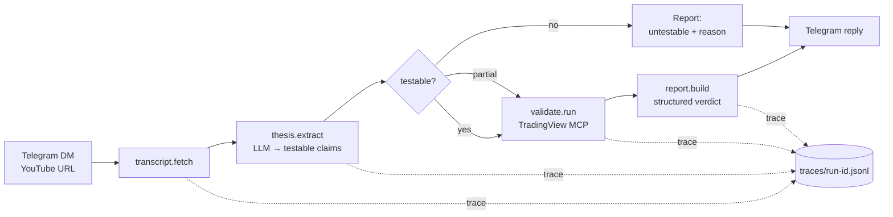

# agent-research-lab

**Designing reliable autonomous research and validation systems under uncertainty.**

You DM a YouTube URL to a Telegram bot. An agent fetches the transcript, extracts the *testable* trading claim(s), runs a defined validation against real market data via the [TradingView MCP](https://github.com/), produces a structured report — thesis, what was tested, the data, the result, the caveats, a verdict — and replies. Every step is traced. Every failure mode is handled and documented.

This is a small, focused system. It is deliberately small. The interesting part is not "AI watches YouTube videos" — it's the orchestration, the decision logic for *what is even testable*, the validation layer, the failure-aware workflow, and the observability trail. The pattern transfers to any autonomous-research problem; the domain here happens to be trading content.

---

## What it does



1. **Ingest** — `transcript.py` pulls and cleans the YouTube transcript.
2. **Extract** — `thesis.py` runs an LLM over the transcript and extracts *testable claims* — each tagged with instrument, timeframe, test type, and whether it's actually testable (with a reason if not). Most trading videos contain opinion, narrative, or vibes; the agent's first job is honestly separating "this is a checkable claim" from "this is a take."
3. **Validate** — `validate.py` calls the TradingView MCP (`symbol_search`, `data_get_ohlcv`, `data_get_indicator`, `data_get_study_values`) to pull the actual market data and check the claim against it. v1 supports two test types: indicator-value-over-range checks and level/zone hit-rate checks. Strategy-shaped claims that need a full backtest are honestly marked "untestable in v1 — needs a backtest engine."
4. **Report** — `report.py` builds a structured result: `{thesis, what_was_tested, data_summary, result, caveats, verdict}` where verdict ∈ {holds, partial, fails, untestable}.
5. **Reply** — `telegram_bot.py` posts the report back.
6. **Trace** — every run writes `traces/<run-id>.jsonl`, one line per step. For the examples in this repo, those traces are committed so you can read the agent's reasoning trail.

## What it deliberately does NOT do (yet)

This is v1. Out of scope on purpose — each of these would be a separate, larger effort:

- ❌ Instagram / TikTok ingestion
- ❌ Video → Pine Script (or any chart-language) code generation
- ❌ A general backtest engine for strategy-shaped claims
- ❌ A standalone replay engine
- ❌ A separate decision-graph orchestration layer (v1 orchestration is sequential and simple, on purpose)
- ❌ Multi-test / batch processing
- ❌ A look-ahead-bias detector (a genuinely good idea — it deserves its own repo)

The point of v1 is one vertical slice that works end-to-end, is observable, and handles failure honestly. Everything else iterates publicly from there.

## Architecture

See [`docs/architecture.md`](docs/architecture.md). In short:

```
src/agent_research_lab/
├── telegram_bot.py    # input/output edge: listens for YouTube URLs, replies with reports
├── transcript.py      # YouTube transcript fetch + clean
├── thesis.py          # LLM: transcript → testable claims
├── validate.py        # claim → validation run via TradingView MCP
├── report.py          # validation runs → structured report
└── orchestrate.py     # the sequential pipeline; logs each step to traces/
```

Each module has one job, a small typed interface, and can be tested in isolation. The data contract between them is documented in `docs/architecture.md`.

## The interesting docs

- [`docs/decision_logic.md`](docs/decision_logic.md) — how the agent decides what counts as a testable claim, and which test type to run
- [`docs/validation_logic.md`](docs/validation_logic.md) — what the validation actually does, what it can and can't conclude, why
- [`docs/failure_handling.md`](docs/failure_handling.md) — the failure matrix: no transcript, no testable claim, ambiguous claim, MCP error, insufficient data — what happens in each case and why it's handled there

## Run it

```bash
# install
pip install -e .

# one-shot CLI (used to build the examples/)
python -m agent_research_lab.orchestrate "https://www.youtube.com/watch?v=..."

# long-running Telegram listener
python -m agent_research_lab.telegram_bot
```

Config: copy `.env.example` to `.env` and fill in `TELEGRAM_BOT_TOKEN`, `ANTHROPIC_API_KEY`. `config.yml` controls which test types are enabled. The TradingView MCP must be running and reachable (see `docs/validation_logic.md` for setup).

## Examples

[`examples/`](examples/) contains real YouTube trading videos run through the pipeline — input, transcript, extracted thesis, validation run, final report, and the full trace. These are the artifact: read one to see exactly what the agent did and decided.

## Status

v1. Working end-to-end. Built solo. Iterating publicly.

## Why this exists

I build autonomous research and validation systems — that's the work. This repo is a small, public, end-to-end demonstration of how I approach it: separate the testable from the untestable, validate against real data not vibes, handle every failure mode explicitly, and leave a trace someone else can read. The trading domain is incidental; the engineering pattern is the point.

— [R Sai Pavan](https://www.linkedin.com/in/sai-pavan-86635b23/) · saipavan.pilot1@gmail.com

## License

MIT
