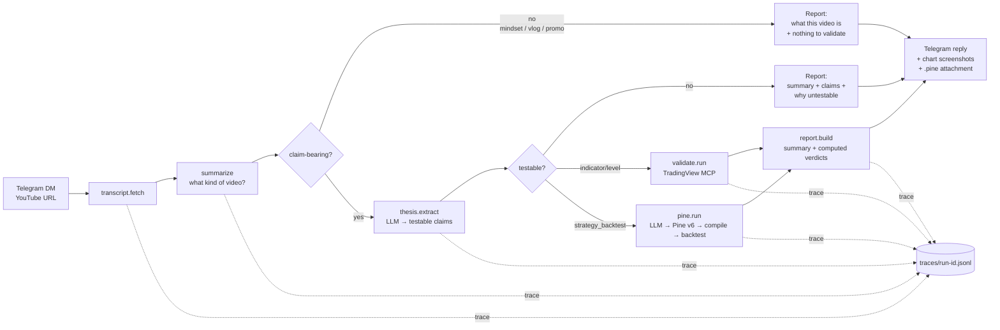

# agent-research-lab


**An observable autonomous validation and orchestration system — built for a trading-content domain, transferable to any research problem under uncertainty.**

*By [R Sai Pavan](https://www.linkedin.com/in/sai-pavan-86635b23/) — autonomous systems operator running live algorithmic trading on Indian options markets. This repo is a public, end-to-end demonstration of how I design systems that reason, validate, and degrade gracefully.*

This is **not** a trading bot, a signal generator, or an AI that watches YouTube videos.

It is a **validation and orchestration system** that happens to operate on trading content. The domain is incidental. The engineering pattern — deterministic evaluation, causal validation, explicit uncertainty, observable workflows, graceful degradation at every failure point — transfers directly to autonomous research pipelines in any domain.

**What it does:** You send a YouTube URL. An agent fetches the transcript, classifies the video, extracts any claims that are operationalizable as tests, runs those tests against real market data via the TradingView MCP, and produces a structured verdict. Every step is traced. Every failure mode is a handled case, not an exception. The report leads with what the video actually is, then answers five questions per claim: what was claimed, what was testable, what data was checked, what happened, why the system concluded what it did.

For strategy claims: the agent synthesizes a complete Pine Script v6 strategy from the transcript, compiles it via the TradingView MCP with a self-repair loop, runs the TradingView strategy tester, and returns real backtest metrics. The `.pine` file is sent as a Telegram document attachment.

The interesting part is not the trading domain. It is the orchestration, the decision logic for *what is even testable*, the failure-aware workflow, and the observability trail.

---

## What it does



1. **Ingest** — `transcript.py` pulls and cleans the YouTube transcript.
2. **Summarize** — `summarize.py` runs first and characterizes the video: strategy/backtest, educational explainer, market commentary, trader psychology, vlog, course pitch, or a mix. It writes a `content_type`, a topic, a 2-4 sentence summary, and a `has_checkable_claims` flag. If the video isn't claim-bearing by nature (psychology / vlog / promo) the pipeline stops here and returns a summary-only report — running a claim extractor over a pep-talk to find zero claims is wasted effort, and saying plainly "this is a mindset video about X" is the honest output.
3. **Extract** — for claim-bearing videos, `thesis.py` extracts *testable claims* — each tagged with instrument, timeframe, test type, and whether it's actually testable (with a reason if not). It gets the summary as context. The agent is allowed — and expected — to say "this is a take, not a checkable claim."
4. **Validate** — two paths, depending on claim type:
   - *Indicator / level claims* — `validate.py` fetches OHLCV bars from TradingView, computes RSI / SMA / EMA in Python, and measures how often the trigger condition led to the claimed outcome over a multi-year lookback.
   - *Strategy claims* — `pine.py` synthesizes a complete Pine Script v6 strategy from the transcript (extracting on-screen code if present, or writing from the verbal description if not), compiles it via the TradingView MCP with an LLM self-repair loop (up to 3 fix attempts), runs the TradingView strategy tester, and returns real backtest metrics: trades, win rate, net profit, max drawdown, profit factor.
5. **Report** — `report.py` builds the report. It **leads with "what this video is"**, then (if there were claims) a structured per-claim result built around five questions: what did the video claim, what was testable, what data was checked, what happened, why the system concluded what it did. Strategy backtest claims get the full metrics table. Verdicts are *computed* from the validation data, not LLM-judged.
6. **Reply** — `telegram_bot.py` sends live progress updates (each step edits one status message), then sends chart screenshots for each validated claim, then the full report text, then any `.pine` files as document attachments.
7. **Trace** — every run writes `traces/<run-id>.jsonl`, one line per step. For the examples in this repo, those traces are committed so you can read the agent's reasoning trail.

## Architecture

```
src/agent_research_lab/
├── telegram_bot.py    # input/output edge: listens for YouTube URLs, sends live progress + charts + report
├── transcript.py      # YouTube transcript fetch + clean
├── summarize.py       # transcript → "what kind of video is this?" (runs first; routes the pipeline)
├── thesis.py          # transcript + summary → testable claims (via llm.py)
├── validate.py        # claim → validation run via TradingView MCP (indicator/level claims)
├── pine.py            # claim → Pine Script v6 → compile → backtest → ValidationRun (strategy claims)
├── report.py          # summary + validation runs → report (leads with "what this video is"; verdicts computed, not LLM-judged)
├── orchestrate.py     # the sequential pipeline; logs each step to traces/; step callbacks for live progress
├── watchlist.py       # predefined symbol lists (default, nifty50, sp500, crypto, forex, commodities)
├── llm.py             # backend-agnostic LLM: claude CLI (default) | Anthropic API | Gemini API
├── mcp_client.py      # thin TradingView MCP client (retries, error → untestable, never crashes a run)
├── config.py          # loads config.yml + .env
└── types.py           # the dataclasses passed between modules
```

Each module has one job, a small typed interface, and can be tested in isolation. The data contract between them is documented in `docs/architecture.md`.

## Design Principles

These six principles govern every architectural decision in this system. They are not aspirational — they are constraints that shaped specific code choices.

**1. Deterministic evaluation.**
Verdicts are computed by explicit thresholds in code, not generated by an LLM. `hit_rate >= 0.65 → holds`, `hit_rate < 0.45 → fails`. The LLM extracts claims and writes narrative; it does not judge outcomes. Run the same data twice, get the same verdict. This makes the system auditable and testable in isolation.

**2. Causal validation.**
The system tests whether a *specific, operationalizable trigger* led to a *specific, measurable outcome* — not whether the video "seems right." Claims that can't be operationalized (no instrument, no threshold, no timeframe) are marked untestable and the reason is stated explicitly. Vagueness is not glossed over; it is surfaced.

**3. Explicit uncertainty.**
Every verdict carries a reason: how many occurrences, what the rate was, why it fell into that bucket, what caveats apply. "Partial support — 58% of 89 occurrences, falls short of the 65% threshold" is more honest than a binary pass/fail. Insufficient data is a verdict, not a failure to run.

**4. Graceful degradation.**
No transcript, no instrument named, MCP unreachable, Pine script won't compile after 3 retries — each produces a structured result with a reason, not a crash. Untestable is a valid output. The pipeline never aborts because one claim failed; it degrades per-claim and reports honestly. The Telegram chart step failing doesn't stop the report.

**5. Observable workflows.**
Every run writes a `.jsonl` trace — one line per step, with timing, outcome, and detail. Nothing happens silently. The committed examples in `examples/` include their full traces: read one to see exactly what the agent decided, when, and how long each step took. The Telegram bot sends live progress as each step completes, not a single status after everything finishes.

**6. Replay integrity.**
The artifact bundle (`runs/<run_id>/`) is self-contained: transcript, extracted claims, validation data, report, and trace. You can reconstruct exactly what the agent saw and decided, months later, without re-running anything. The examples in this repo are committed in that form — they are not curated summaries, they are complete run artifacts.

## The interesting docs

- [`docs/decision_logic.md`](docs/decision_logic.md) — how the agent decides what counts as a testable claim, and which test type to run
- [`docs/validation_logic.md`](docs/validation_logic.md) — what the validation actually does, what it can and can't conclude, why
- [`docs/failure_handling.md`](docs/failure_handling.md) — the failure matrix: no transcript, no testable claim, ambiguous claim, MCP error, insufficient data — what happens in each case and why it's handled there

## Run it

```bash
# install
pip install -e .

# one-shot CLI: prints the report to stdout AND saves the full bundle to runs/<run_id>/
python -m agent_research_lab.orchestrate "https://www.youtube.com/watch?v=..."

# with timeframe override (test indicator claims on 1H, 4H, Daily, Weekly)
python -m agent_research_lab.orchestrate "https://youtu.be/..." --timeframe 60,240,D,W

# scan a claim across an entire watchlist
python -m agent_research_lab.orchestrate "https://youtu.be/..." --watchlist nifty50

# long-running Telegram listener
python -m agent_research_lab.telegram_bot
```

Every CLI run saves a full artifact bundle under `runs/<run_id>/`:

| File | Contents |
|------|----------|
| `input.md` | URL + run timestamp |
| `transcript.txt` | fetched transcript |
| `summary.json` | what kind of video this is |
| `thesis.json` | extracted claims |
| `report.md` | the human-readable report |
| `report.json` | the structured report |
| `trace.jsonl` | step-by-step trace |
| `strategy_<id>.pine` | synthesized Pine Script (strategy claims only) |

`runs/` is gitignored; the committed polished version of the same bundle layout lives in `examples/`.

**Watchlists** — `--watchlist <name>` scans all testable claims across a predefined symbol list:

| Name | Symbols |
|------|---------|
| `default` | 16 cross-market essentials: SPX, NDX, DJI, DAX, NIFTY, BTCUSD, ETHUSD, EURUSD, XAUUSD, USOIL, and more |
| `nifty50` | 50 Nifty 50 constituents (NSE India) |
| `sp500` | 50 S&P 500 large-caps |
| `crypto` | 10 major crypto pairs |
| `forex` | 10 major FX pairs |
| `commodities` | 8 commodities |

**LLM backend — no API key required.** The pipeline needs an LLM for thesis extraction. It auto-detects, in order:

1. the **`claude` CLI** on your PATH (Claude Code) — uses your existing subscription, no key needed. **This is the default.**
2. `ANTHROPIC_API_KEY` set — Anthropic API (`pip install 'agent-research-lab[anthropic]'`)
3. `GEMINI_API_KEY` set — Gemini API, whose free tier covers this workload (`pip install 'agent-research-lab[gemini]'`)

Force a backend with `AGENT_RESEARCH_LAB_LLM={claude_cli,anthropic,gemini}`. See `src/agent_research_lab/llm.py`.

**Other config:** copy `.env.example` → `.env`. For the Telegram listener you need `TELEGRAM_BOT_TOKEN`. For validation runs you need a running TradingView MCP — set `TRADINGVIEW_MCP_URL` to its endpoint (or leave empty and validation steps will honestly report "untestable — MCP not configured"). `config.yml` controls which test types are enabled and the default timeframes.

## Examples

[`examples/`](examples/) contains real YouTube trading videos run through the pipeline — input, transcript, extracted thesis, validation run, final report, and the full trace. These are the artifact: read one to see exactly what the agent did and decided.

| Example | Video type | Verdict |
|---------|-----------|---------|
| [01 — RSI + Bollinger Bands backtest](examples/01_rsi_bollinger_tested_2025/) | Strategy backtest (video author's own test) | untestable — no MCP-resolvable claims |
| [02 — RSI: profitable or overhyped?](examples/02_rsi_profitable_or_overhyped/) | Market commentary | untestable — opinion, not checkable |
| [03 — RSI divergence on XAUUSD](examples/03_rsi_divergence_xauusd/) | Educational explainer | partial — divergence signal is real but overstated |
| [04 — AlphaInsider promo walkthrough](examples/04_alphainsider_promo_walkthrough/) | Promotion | untestable — no checkable claim |
| [05 — ORB acceptance short, no claims](examples/05_orb_acceptance_short_no_claims/) | Short / mindset | untestable — no claims |
| [06 — ORB Pine strategy backtest](examples/06_orb_pine_strategy_backtest/) | Strategy claim | fails — 66 trades, 48.5% WR, PF 0.91 (net negative) |
| [07 — ICT key levels framework](examples/07_ict_key_levels_educational/) | Educational framework | untestable — teaching a methodology, no specific claim |

## Status

v1. Working end-to-end. Built solo. Iterating publicly.

## What makes this different from "AI summarizes YouTube"

Most AI video tools summarize what the creator *said*. This system evaluates whether what they said is *true* — against real market data, by explicit rules, with documented uncertainty.

The difference is epistemic. Summarization is retrieval. Validation is reasoning under uncertainty with a defined decision procedure. The report doesn't just reflect the video; it interrogates it.

This distinction is also why the system can be wrong in a useful way. If a claim fails validation, the report shows the rate, the sample size, and the threshold. You can see exactly why — and decide whether you trust the threshold. An AI summary cannot be wrong in a useful way; it just reflects the source.

## Why this exists

I build autonomous research and validation systems — that's the work. This repo is a small, public, end-to-end demonstration of how I approach it: separate the testable from the untestable, validate against real data not vibes, handle every failure mode explicitly, and leave a trace someone else can read. The trading domain is incidental; the engineering pattern is the point.

— [R Sai Pavan](https://www.linkedin.com/in/sai-pavan-86635b23/) · saipavan.pilot1@gmail.com

## License

MIT
