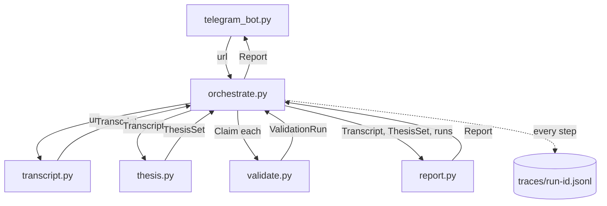

# Architecture

## Principle

One vertical slice, sequential orchestration, each module with one job and a small typed interface. No premature abstraction — no plugin system, no decision graph, no message bus. The slice has to work end-to-end and be readable before any of that earns its place.

## Modules and the data contract between them



| Module | Input | Output | Depends on |
|---|---|---|---|
| `transcript.py` | `url: str` | `Transcript {video_id, title, channel, url, text, fetched_at}` | `youtube-transcript-api` |
| `thesis.py` | `Transcript` | `ThesisSet {video_id, claims: list[Claim]}` where `Claim {id, statement, instrument, timeframe, test_type, testable: "yes"|"partial"|"no", reason_if_not, confidence}` | `llm.py`, `config.yml` (extraction) |
| `validate.py` | `Claim` | `ValidationRun {claim_id, test_type, status: "ok"|"error"|"insufficient_data", tradingview_query, data_summary, result, caveats}` | `mcp_client.py` (TradingView MCP), `config.yml` (test_types, validation) |
| `report.py` | `Transcript`, `ThesisSet`, `list[ValidationRun]` | `Report {video, claims_table, per_claim_findings, verdict_overall, markdown, json}` | `llm.py` (narrative synthesis only — the verdicts are computed, not LLM-judged) |
| `llm.py` | `system, prompt` | `str` | auto-detects: `claude` CLI (default, no key) → Anthropic API → Gemini API |
| `mcp_client.py` | `tool_name, args` | `dict` | TradingView MCP (HTTP/SSE via `TRADINGVIEW_MCP_URL`); retries per config; raises `McpError` (which `validate.py` turns into an `error` ValidationRun) |
| `orchestrate.py` | `url: str` | `Report` | all of the above; writes `traces/<run-id>.jsonl` |
| `telegram_bot.py` | Telegram update with a YouTube URL | replies with `Report.markdown` | `orchestrate.py`, `python-telegram-bot`, `.env` (token, allowlist) |

## Why these boundaries

- **`thesis.py` is separate from `validate.py`** because "what is testable" is a different judgment from "run the test." Conflating them is how you end up validating things that were never checkable. `thesis.py` is allowed to say "no, that's an opinion" — and that's a first-class outcome, not an error.
- **`report.py` computes verdicts, the LLM only narrates.** `verdict ∈ {holds, partial, fails, untestable}` is derived from the `ValidationRun` data by explicit rules in `report.py`, not asked of a model. The LLM writes the human-readable summary around those computed verdicts. This keeps the conclusion auditable.
- **`orchestrate.py` owns tracing.** Each module returns plain data; it doesn't know about tracing. The orchestrator logs `{step, input_summary, output_summary, duration_ms, ok}` per step. One place to change the trace format.
- **`telegram_bot.py` is the only stateful, long-running thing.** Everything else is pure-ish functions over data. You can run the whole pipeline from the CLI (`orchestrate.py`) with no Telegram involved — that's how `examples/` were built.

## Run-id and traces

`orchestrate.process(url)` mints a run-id (`{video_id}-{YYYYMMDDTHHMMSSZ}`) and writes `traces/<run-id>.jsonl`:

```jsonl
{"step": "transcript.fetch", "ok": true, "summary": "fetched 4,210 words from 'XYZ Trading'", "ms": 1840}
{"step": "thesis.extract", "ok": true, "summary": "2 claims: 1 testable, 1 partial", "ms": 5210}
{"step": "validate.run", "claim_id": "c1", "ok": true, "summary": "RSI<30 zone, 1D, 365d: claim says 'always bounces'; actual: bounced 14/22 (64%)", "ms": 2300}
{"step": "validate.run", "claim_id": "c2", "ok": false, "summary": "claim partial — no instrument named; skipped", "ms": 1}
{"step": "report.build", "ok": true, "summary": "verdict_overall=partial; 1 holds-with-caveats, 1 untestable", "ms": 3100}
```

For runs done via the CLI to build `examples/`, the trace is copied into `examples/<n>_<slug>/trace.jsonl` and committed. Ad-hoc runs leave their trace in `traces/` which is gitignored.

## What's not here, on purpose

No dependency-injection container. No abstract `Ingestor`/`Validator` base classes (there's exactly one ingester and one validator backend; abstractions for a population of one are noise). No async — the pipeline is IO-bound on a handful of network calls in sequence; `asyncio` would add machinery for no throughput gain at v1 scale. When there's a second ingestion source or a real backtest backend, the boundaries above are where the seams go — but not before.
