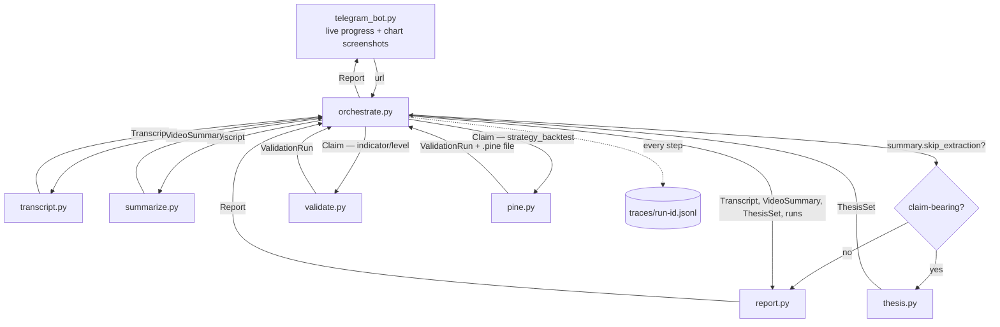

# Architecture

## Principle

One vertical slice, sequential orchestration, each module with one job and a small typed interface. No premature abstraction — no plugin system, no decision graph, no message bus. The slice has to work end-to-end and be readable before any of that earns its place.

## Modules and the data contract between them



| Module | Input | Output | Depends on |
|---|---|---|---|
| `transcript.py` | `url: str` | `Transcript {video_id, title, channel, url, text, word_count}` | `youtube-transcript-api` |
| `summarize.py` | `Transcript` | `VideoSummary {content_type, topic, summary, has_checkable_claims}` — runs first; routes the pipeline; non-claim videos (mindset/vlog/promo) skip extraction | `llm.py` |
| `thesis.py` | `Transcript`, `VideoSummary` | `ThesisSet {video_id, claims: list[Claim]}` where `Claim {id, statement, instrument, timeframe, test_type, testable: "yes"\|"partial"\|"no", reason_if_not, confidence}` | `llm.py`, `config.yml` |
| `validate.py` | `Claim` (indicator/level only) | `list[ValidationRun]` — one per timeframe tested | `mcp_client.py`, `config.yml` |
| `pine.py` | `Claim` (strategy_backtest only), `Transcript`, `VideoSummary` | `ValidationRun` with embedded `StrategyBacktestMetrics` and `.pine` file path | `llm.py`, `mcp_client.py` |
| `report.py` | `Transcript`, `VideoSummary`, `ThesisSet`, `list[ValidationRun]` | `Report {findings, verdict_overall, markdown, json}` — verdicts computed by explicit thresholds, not LLM-judged | — |
| `watchlist.py` | `name: str` | `list[str]` symbol list; `run_watchlist()` applies a claim across all symbols | `validate.py` |
| `llm.py` | `system, prompt` | `str` | auto-detects: `claude` CLI → Anthropic API → Gemini API |
| `mcp_client.py` | `tool_name, args` | `dict` | TradingView MCP (spawned via `TRADINGVIEW_MCP_CMD`); retries once; converts errors to `McpError` |
| `orchestrate.py` | `url: str` | `Report` | all modules; writes traces; fires `step_callback` for live Telegram progress |
| `telegram_bot.py` | Telegram message with YouTube URL | edits live status + sends chart photos + sends report text + sends `.pine` attachments | `orchestrate.py`, `mcp_client.py`, `python-telegram-bot` |

## Claim routing

`orchestrate.py` splits testable claims by `test_type` before entering the MCP session:

```python
backtest_claims  = [c for c in thesis.testable_claims if c.test_type == "strategy_backtest"]
indicator_claims = [c for c in thesis.testable_claims if c.test_type != "strategy_backtest"]

for claim in indicator_claims:
    runs.extend(validate_mod.run(claim, config, mcp, timeframes_override=...))

for claim in backtest_claims:
    runs.append(pine_mod.run(claim, transcript, summary, config, mcp, out_dir=run_dir))
```

Both paths return `ValidationRun` objects. `report.py` handles them uniformly — it detects strategy results via `vr.strategy_backtest is not None`.

## Verdict computation

Verdicts are computed by explicit thresholds in `report.py`, not generated by the LLM:

**Indicator / level claims:**
- `hit_rate >= 0.65` AND `n >= 10` → `holds`
- `hit_rate < 0.45` → `fails`
- otherwise → `partial`
- `n < 10` → `partial` (insufficient sample regardless of rate)

**Strategy backtest claims:**
- `profit_factor >= 1.5` AND `net_profit > 0` AND `total_trades >= 20` → `holds`
- `profit_factor < 1.0` OR `net_profit < 0` → `fails`
- otherwise → `partial`
- `total_trades < 20` → `partial` (too few trades)

These thresholds are constants in `report.py`. They apply the same way to every run — no per-video calibration, no LLM judgment.

## Multi-timeframe aggregation

For indicator claims, `validate.py` tests across multiple timeframes (default: 1H, 4H, D, W from `config.yml`). `report.py`'s `_verdict_for()` aggregates:

- All timeframes agree → that verdict
- Timeframes disagree → `partial` with a breakdown showing each timeframe's rate
- All timeframes untestable → `untestable`

Timeframe priority: `--timeframe` CLI flag > claim-extracted timeframe > config defaults.

## Pine Script compile-repair loop

`pine.py`'s `_compile_and_fix()` loop is worth explaining separately because its design reflects a specific choice about where to put trust.

The loop:
1. Set source via MCP → smart compile → read errors
2. If no errors: return the script
3. If errors remain and retries are available: LLM fix call → loop
4. If errors persist after all retries: return the script with the error list — caller marks the run as `insufficient_data`, file is still saved, trace logs what happened

The key design choice: **the goal was not "trust the model to produce valid Pine." The goal was "design a workflow where model failures become observable and recoverable."**

This changes what matters:

- The LLM synthesizing imperfect Pine on the first pass is expected and fine — the compile loop catches it
- Bounded retries (max 3) mean a bad script never blocks a run indefinitely
- Explicit failure states (`pine_max_retries`, `pine_compile_error`) mean the system reports what happened precisely — not "error," but which failure mode, at which step
- The `.pine` file is written to disk regardless of compile outcome — you can inspect, fix, and re-run manually
- The trace logs each fix attempt with timing

In practice, the Claude CLI backend has been more stable than the standard API for iterative repair because it:
- Preserves intent during repairs (makes localized fixes rather than rewriting entire scripts)
- Handles multi-turn compiler feedback chains more reliably
- Maintains architectural consistency across retries (e.g., doesn't silently drop stop-loss rules to fix a compile error)

But that's a secondary observation. The primary design is that **even if the synthesis model performs poorly, the system architecture ensures the failure is caught, named, logged, and recoverable** — not silently swallowed or misleadingly reported as a success.

This same principle governs the broader pipeline: synthesis is separated from validation so that a model's output quality is never the last line of defense.

## Why these boundaries

- **`thesis.py` is separate from `validate.py`** because "what is testable" is a different judgment from "run the test." `thesis.py` is allowed to say "no, that's an opinion" — and that's a first-class outcome, not an error.
- **`pine.py` is separate from `validate.py`** because strategy synthesis (LLM → code → compile → backtest) is a fundamentally different workflow from indicator measurement. The failure modes, retries, and outputs are all different.
- **`report.py` computes verdicts, the LLM only extracts claims.** `verdict ∈ {holds, partial, fails, untestable}` is derived from `ValidationRun` data by explicit rules. Same data → same verdict, always.
- **`orchestrate.py` owns tracing and step callbacks.** Each module returns plain data; it doesn't know about tracing or progress. One place to change either.
- **`telegram_bot.py` is the only stateful, long-running component.** Everything else is pure-ish functions over data — you can run the full pipeline from the CLI with no Telegram involved.

## Run artifacts

Every CLI run saves a self-contained bundle to `runs/<run_id>/`:

```
runs/nX_TB0yvUO0-20260514T121851Z/
├── input.md          # URL + run timestamp
├── transcript.txt    # fetched transcript text
├── summary.json      # VideoSummary
├── thesis.json       # extracted claims
├── report.md         # human-readable report (5-question structure per claim)
├── report.json       # structured report (machine-readable)
├── trace.jsonl       # step-by-step trace
└── strategy_c1.pine  # synthesized Pine Script (strategy claims only)
```

The `runs/` directory is gitignored. `examples/` is the committed, polished version of the same layout — each example is a complete run artifact.

## Trace format

```jsonl
{"step": "transcript.fetch", "ok": true, "detail": "fetched 4,210 words", "ms": 1840}
{"step": "video.summarize", "ok": true, "detail": "strategy_or_claim — ORB intraday strategy SPY", "ms": 3200}
{"step": "thesis.extract", "ok": true, "detail": "1 claims: 1 testable, 0 not", "ms": 5100}
{"step": "pine.run", "ok": true, "detail": "[orb-c1] Pine synthesis: ok — strategy compiled and backtested", "ms": 28400}
{"step": "report.build", "ok": true, "detail": "verdict_overall=fails; 1 claim(s)", "ms": 12}
```

## What's not here, on purpose

No dependency-injection container. No abstract base classes for ingestors or validators (there's one of each; abstractions for a population of one are noise). No general async in the pipeline — it's IO-bound on a handful of sequential network calls; `asyncio` is only in `telegram_bot.py` where it's required by the framework. When there's a second ingestion source or a real strategy engine, the boundaries above are where the seams go — not before.
